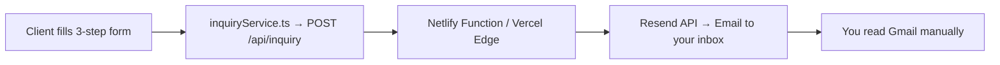
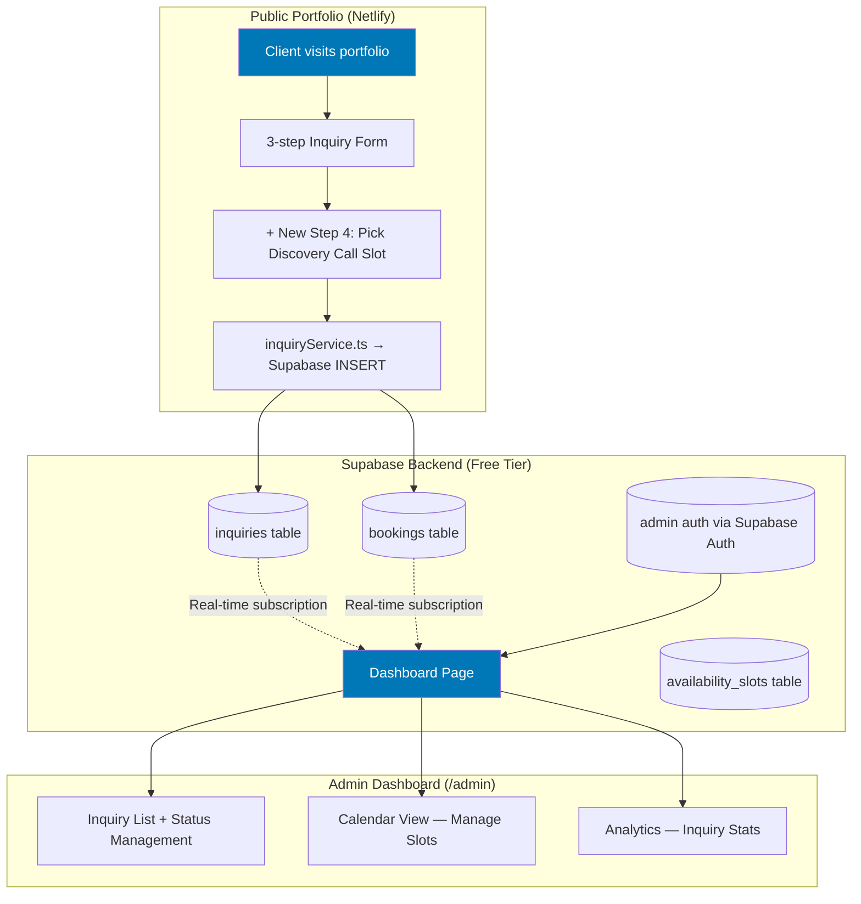
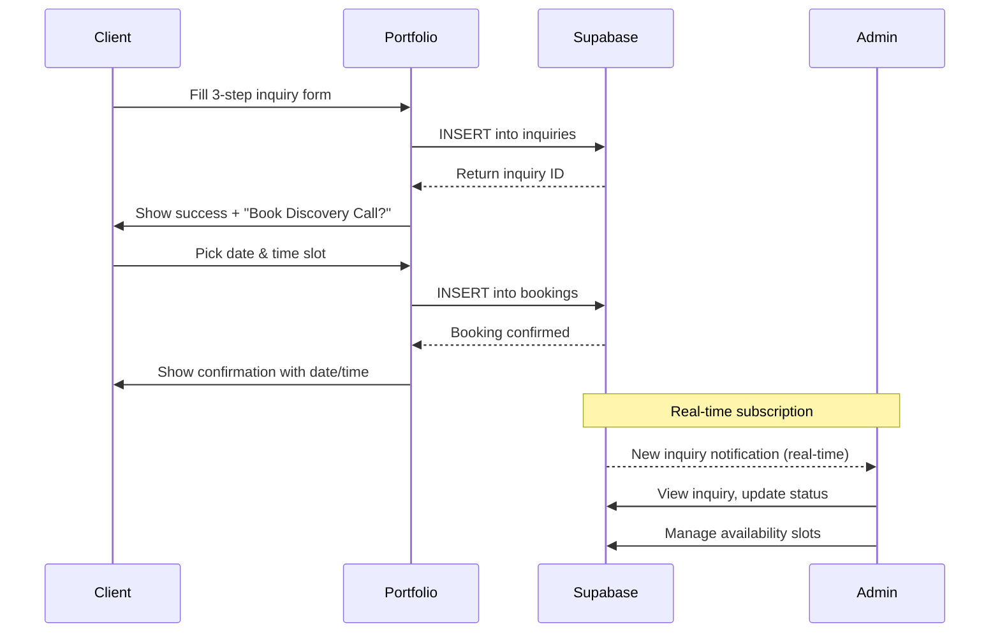

# Backend Service & Admin Dashboard — Implementation Plan

## Current System Analysis

Your portfolio is a **React + Vite + TypeScript** SPA deployed on Netlify, using Tailwind CSS v4, Framer Motion, GSAP, and Lenis for smooth scroll. The current inquiry flow works like this:



**Key files in the current flow:**
- [ProjectInquiryForm.tsx](file:///c:/Users/Nitro%20V15/Documents/GitHub/react-portfolio-2k26/src/components/home/ProjectInquiryForm.tsx) — 3-step multi-step form (personal → scope → brief)
- [inquirySchema.ts](file:///c:/Users/Nitro%20V15/Documents/GitHub/react-portfolio-2k26/src/types/inquirySchema.ts) — Zod validation schemas with service/budget/timeline options
- [inquiryService.ts](file:///c:/Users/Nitro%20V15/Documents/GitHub/react-portfolio-2k26/src/services/inquiryService.ts) — Frontend fetch wrapper (with local-dev fallback)
- [inquiry.ts (Netlify)](file:///c:/Users/Nitro%20V15/Documents/GitHub/react-portfolio-2k26/netlify/functions/inquiry.ts) — Serverless function using Resend to email you
- [InquirySuccess.tsx](file:///c:/Users/Nitro%20V15/Documents/GitHub/react-portfolio-2k26/src/components/home/inquiry/InquirySuccess.tsx) — Success screen with a `VITE_DISCOVERY_CALL_URL` link to an external Cal.com

**Problems with the current approach:**
1. Inquiries go to your email — easy to lose, no tracking, no status management
2. Discovery call scheduling is an external link with no integration
3. No way to see inquiry history, analytics, or manage client pipeline
4. No persistence layer — if Resend fails, data is lost

---

## Backend Recommendation: Supabase

> [!IMPORTANT]
> **I strongly recommend Supabase over Firebase** for your use case. Here's why:

| Criteria | Supabase (Free Tier) | Firebase (Spark Plan) |
|:---|:---|:---|
| **Database** | 500 MB PostgreSQL (full SQL, joins, views) | 1 GiB Firestore (NoSQL, limited querying) |
| **Auth MAUs** | 50,000 | 50,000 |
| **Storage** | 1 GB | 5 GB |
| **Edge Functions** | 500K invocations | Cloud Functions require Blaze plan |
| **Real-time** | ✅ Built-in (Postgres Changes) | ✅ Built-in |
| **Row Level Security** | ✅ Native RLS policies | ❌ Security Rules (different paradigm) |
| **Free Cloud Functions** | ✅ Edge Functions on free tier | ❌ Requires Blaze (pay-as-you-go) |
| **SQL Power** | Full PostgreSQL — views, triggers, aggregates | Limited NoSQL queries |
| **React SDK** | `@supabase/supabase-js` — lightweight | `firebase` — heavier bundle |

> [!TIP]
> For a **booking/scheduling + dashboard** system, PostgreSQL's relational model is far superior. You need to join inquiries → bookings → time slots, run date-range queries, and aggregate analytics. This is trivially easy with SQL but painful with Firestore.

**Supabase free tier is more than enough for your portfolio's scale** — you won't hit 500MB of inquiries or 50K MAUs for a very long time.

---

## Proposed Architecture



---

## Database Schema Design

### Table: `inquiries`
Stores every form submission with lifecycle tracking.

```sql
CREATE TABLE inquiries (
  id            UUID DEFAULT gen_random_uuid() PRIMARY KEY,
  full_name     TEXT NOT NULL,
  company       TEXT,
  email         TEXT NOT NULL,
  phone         TEXT,
  website       TEXT,
  services      TEXT[] NOT NULL,          -- e.g. ['Website Development', 'UI/UX']
  budget        TEXT NOT NULL,
  timeline      TEXT NOT NULL,
  project_type  TEXT NOT NULL,
  feature_chips TEXT[],
  description   TEXT NOT NULL,
  attachments   JSONB DEFAULT '[]',       -- [{name, size, type, url}]
  status        TEXT DEFAULT 'new'        -- 'new' | 'reviewed' | 'contacted' | 'booked' | 'completed' | 'archived'
                CHECK (status IN ('new','reviewed','contacted','booked','completed','archived')),
  notes         TEXT,                     -- admin private notes
  created_at    TIMESTAMPTZ DEFAULT NOW(),
  updated_at    TIMESTAMPTZ DEFAULT NOW()
);
```

### Table: `availability_slots`
Your configurable availability windows (recurring or one-off).

```sql
CREATE TABLE availability_slots (
  id            UUID DEFAULT gen_random_uuid() PRIMARY KEY,
  day_of_week   INT,                       -- 0=Sun..6=Sat (for recurring)
  specific_date DATE,                      -- for one-off overrides
  start_time    TIME NOT NULL,             -- e.g. '09:00'
  end_time      TIME NOT NULL,             -- e.g. '17:00'
  slot_duration INT DEFAULT 30,            -- minutes per slot
  is_active     BOOLEAN DEFAULT TRUE,
  created_at    TIMESTAMPTZ DEFAULT NOW()
);
```

### Table: `bookings`
Links an inquiry to a specific discovery call time slot.

```sql
CREATE TABLE bookings (
  id            UUID DEFAULT gen_random_uuid() PRIMARY KEY,
  inquiry_id    UUID REFERENCES inquiries(id) ON DELETE SET NULL,
  client_name   TEXT NOT NULL,
  client_email  TEXT NOT NULL,
  booked_date   DATE NOT NULL,
  booked_time   TIME NOT NULL,
  duration      INT DEFAULT 30,            -- in minutes
  meeting_type  TEXT DEFAULT 'discovery'   -- 'discovery' | 'follow-up' | 'consultation'
                CHECK (meeting_type IN ('discovery','follow-up','consultation')),
  status        TEXT DEFAULT 'confirmed'   -- 'confirmed' | 'cancelled' | 'completed' | 'no-show'
                CHECK (status IN ('confirmed','cancelled','completed','no-show')),
  meeting_link  TEXT,                      -- auto-generated Google Meet / Zoom link
  notes         TEXT,
  created_at    TIMESTAMPTZ DEFAULT NOW(),
  updated_at    TIMESTAMPTZ DEFAULT NOW()
);
```

### Row Level Security (RLS)

```sql
-- Public clients can INSERT inquiries and bookings, but never read others' data
ALTER TABLE inquiries ENABLE ROW LEVEL SECURITY;
CREATE POLICY "Anyone can insert" ON inquiries FOR INSERT WITH CHECK (true);
CREATE POLICY "Only admin reads" ON inquiries FOR SELECT USING (auth.role() = 'authenticated');

-- Availability slots are public-read (clients need to see open times)
ALTER TABLE availability_slots ENABLE ROW LEVEL SECURITY;
CREATE POLICY "Public can read active slots" ON availability_slots FOR SELECT USING (is_active = true);
CREATE POLICY "Only admin modifies" ON availability_slots FOR ALL USING (auth.role() = 'authenticated');

-- Bookings: public can insert, only admin reads all
ALTER TABLE bookings ENABLE ROW LEVEL SECURITY;
CREATE POLICY "Anyone can book" ON bookings FOR INSERT WITH CHECK (true);
CREATE POLICY "Only admin reads" ON bookings FOR SELECT USING (auth.role() = 'authenticated');
```

---

## Proposed Changes

### Component 1: Supabase Integration Layer

#### [NEW] `src/lib/supabase.ts`
Initialize the Supabase client using `VITE_SUPABASE_URL` and `VITE_SUPABASE_ANON_KEY` environment variables. Single shared instance for the entire app.

#### [NEW] `src/services/bookingService.ts`
Service layer for:
- `fetchAvailableSlots(date: Date)` — queries `availability_slots` and cross-references `bookings` to return open time slots
- `createBooking(inquiryId, date, time)` — inserts into `bookings` table
- `getBookingByInquiry(inquiryId)` — checks if an inquiry already has a booking

#### [MODIFY] [inquiryService.ts](file:///c:/Users/Nitro%20V15/Documents/GitHub/react-portfolio-2k26/src/services/inquiryService.ts)
Replace the current `fetch('/api/inquiry')` → Resend flow with a direct `supabase.from('inquiries').insert()` call. This eliminates the need for the Netlify serverless function entirely. The file attachments will be uploaded to Supabase Storage and stored as URLs in the JSONB `attachments` column.

---

### Component 2: Enhanced Inquiry Form (+ Scheduling Step)

#### [MODIFY] [ProjectInquiryForm.tsx](file:///c:/Users/Nitro%20V15/Documents/GitHub/react-portfolio-2k26/src/components/home/ProjectInquiryForm.tsx)
- Add an **optional Step 4** after submission success: "Book a Discovery Call"
- Update the progress bar from 3 steps → 3 steps + post-submit booking flow
- On submit: insert into Supabase → show success → offer booking

#### [NEW] `src/components/home/inquiry/Step4BookingSlot.tsx`
A date-picker + time-slot selector that:
- Shows a calendar for the next 14 days
- Fetches available slots from Supabase for the selected date
- Lets the client pick a slot and confirm
- Inserts into `bookings` table linked to their inquiry

#### [MODIFY] [InquirySuccess.tsx](file:///c:/Users/Nitro%20V15/Documents/GitHub/react-portfolio-2k26/src/components/home/inquiry/InquirySuccess.tsx)
Replace the current external `cal.com` link with the integrated booking component. The flow becomes: Success screen → inline "Book a Discovery Call" → date/time picker → confirmation.

---

### Component 3: Admin Dashboard (`/admin`)

> [!IMPORTANT]
> The admin dashboard will be a **protected route** at `/admin`, accessible only after logging in with your Supabase email/password account. No public user registration — just your single admin account.

#### [NEW] `src/pages/admin/AdminLogin.tsx`
Minimal, premium login page with email + password using `supabase.auth.signInWithPassword()`. Styled to match the portfolio's dark glassmorphism aesthetic.

#### [NEW] `src/pages/admin/AdminDashboard.tsx`
Main dashboard layout with sidebar navigation:
- **Overview** — stats cards (new inquiries today, upcoming calls, total inquiries)
- **Inquiries** — full list with search, filter by status, sort
- **Calendar** — manage availability + view booked slots
- **Settings** — profile, notification preferences

#### [NEW] `src/pages/admin/InquiriesPage.tsx`
- Sortable, filterable table of all inquiries
- Status badges: `new` (blue) → `reviewed` (yellow) → `contacted` (purple) → `booked` (green) → `completed` (gray)
- Click to expand → full inquiry details + add private notes
- Action buttons: change status, archive, link to booking

#### [NEW] `src/pages/admin/InquiryDetailPanel.tsx`
Slide-out panel or modal showing full inquiry details:
- Client info, services, budget, timeline, description
- Attachments viewer (images/PDFs)
- Status timeline/history
- Private admin notes (editable)
- Quick action: "Schedule Call" → opens booking creator

#### [NEW] `src/pages/admin/CalendarPage.tsx`
- Weekly/monthly calendar view
- Set your availability (recurring: Mon-Fri 9am-5pm, or custom per-day)
- View all booked discovery calls on the calendar
- Click a booking to see details or cancel/reschedule

#### [NEW] `src/pages/admin/AvailabilityManager.tsx`
- UI to set recurring weekly availability (e.g., "Mon-Fri, 9:00 AM – 5:00 PM, 30-min slots")
- Override specific dates (block a holiday, add weekend hours)
- Toggle slots active/inactive

#### [NEW] `src/context/AuthContext.tsx`
React context wrapping Supabase Auth:
- `useAuth()` hook → `{ user, isAdmin, loading, signIn, signOut }`
- `<ProtectedRoute>` component wrapping `/admin/*` routes
- Session persistence via `supabase.auth.onAuthStateChange`

#### [NEW] `src/components/admin/AdminLayout.tsx`
Dashboard shell with:
- Collapsible sidebar navigation
- Top bar with user avatar + logout
- Breadcrumbs
- Dark glassmorphism style matching portfolio

---

### Component 4: Routing Updates

#### [MODIFY] [AnimatedRoutes.tsx](file:///c:/Users/Nitro%20V15/Documents/GitHub/react-portfolio-2k26/src/components/AnimatedRoutes.tsx)
Add admin routes:
```tsx
<Route path="/admin/login" element={<AdminLogin />} />
<Route path="/admin/*" element={<ProtectedRoute><AdminDashboard /></ProtectedRoute>} />
```

#### [MODIFY] [main.tsx](file:///c:/Users/Nitro%20V15/Documents/GitHub/react-portfolio-2k26/src/main.tsx)
Wrap the app with `<AuthProvider>` from the new auth context.

---

### Component 5: Cleanup & Environment

#### [DELETE] [netlify/functions/inquiry.ts](file:///c:/Users/Nitro%20V15/Documents/GitHub/react-portfolio-2k26/netlify/functions/inquiry.ts)
No longer needed — inquiries go directly to Supabase from the client.

#### [DELETE] [api/inquiry.ts](file:///c:/Users/Nitro%20V15/Documents/GitHub/react-portfolio-2k26/api/inquiry.ts)
Same — the Vercel-style API route is replaced by Supabase direct insert.

#### [NEW] `.env.example`
Document the required environment variables:
```env
VITE_SUPABASE_URL=https://your-project.supabase.co
VITE_SUPABASE_ANON_KEY=your-anon-key
```

> [!NOTE]
> The `resend` package can be removed from `package.json` since email sending is no longer needed. Supabase's anon key is safe to expose in the frontend — RLS policies protect the data.

---

## New User Flow



---

## Open Questions

> [!IMPORTANT]
> **1. Admin Authentication:** Should the admin login be email/password only (simplest), or do you want Google OAuth ("Sign in with Google") as well? Email/password is the most straightforward for a single-user admin panel.

> [!IMPORTANT]
> **2. Email Notifications:** Do you still want to receive an email when a new inquiry arrives (in addition to the dashboard)? We could keep a lightweight Supabase Edge Function that sends a notification email via Resend when a new row is inserted (using a database webhook/trigger). This would be the best of both worlds.

> [!WARNING]
> **3. Inactivity Pausing:** Supabase free tier pauses projects after **1 week of inactivity**. If your portfolio doesn't receive inquiries for a week, the first visitor would see a ~30-second cold start. Options:
> - Set up a simple cron ping (free via GitHub Actions or UptimeRobot) to keep the project alive
> - Accept the occasional cold start
> - Upgrade to Pro ($25/mo) when this becomes a production tool

> [!IMPORTANT]
> **4. File Attachments:** Currently attachments are base64-encoded and sent via email. With Supabase, should we upload them to **Supabase Storage** (1GB free) and store URLs in the database? This is cleaner and allows preview in the dashboard. Recommended approach.

> [!IMPORTANT]
> **5. Meeting Links:** When a booking is confirmed, should the system auto-generate a **Google Meet** link, or do you prefer to add the meeting link manually from the dashboard? Auto-generation requires Google Calendar API integration (adds complexity).

---

## Verification Plan

### Automated Tests
- Zod schema validation tests for new booking schemas
- `npm run build` — ensure TypeScript compilation succeeds with no errors
- Test Supabase RLS policies: verify anonymous users can only INSERT, not SELECT

### Manual Verification
- Submit a test inquiry → verify it appears in the Supabase `inquiries` table
- Book a test discovery call → verify the time slot is correctly marked as taken
- Log into `/admin` → verify inquiry list, status updates, and calendar views work
- Test RLS: try to read other users' inquiries from the browser console (should fail)
- Test the inactivity ping / cold start behavior

---

## Implementation Phases

| Phase | Scope | Files |
|:---|:---|:---|
| **Phase 1** | Supabase setup + inquiry persistence | `supabase.ts`, `inquiryService.ts` (modify), DB schema |
| **Phase 2** | Booking/scheduling system | `bookingService.ts`, `Step4BookingSlot.tsx`, `availability_slots` |
| **Phase 3** | Auth context + admin login | `AuthContext.tsx`, `AdminLogin.tsx`, route guards |
| **Phase 4** | Admin dashboard — inquiries | `AdminDashboard.tsx`, `InquiriesPage.tsx`, `InquiryDetailPanel.tsx` |
| **Phase 5** | Admin dashboard — calendar & availability | `CalendarPage.tsx`, `AvailabilityManager.tsx` |
| **Phase 6** | Polish, cleanup, environment | Delete old API routes, remove `resend`, `.env.example` |

> [!TIP]
> Each phase is independently deployable. Phase 1 alone gives you persistent inquiry tracking. Phase 2 adds scheduling. Phases 3-5 build the dashboard progressively.

---

## New Dependencies

```json
{
  "@supabase/supabase-js": "^2.x"
}
```

That's the **only new dependency**. The calendar and date picker will be built with custom components using your existing Tailwind + Framer Motion stack — no heavy calendar library needed.
